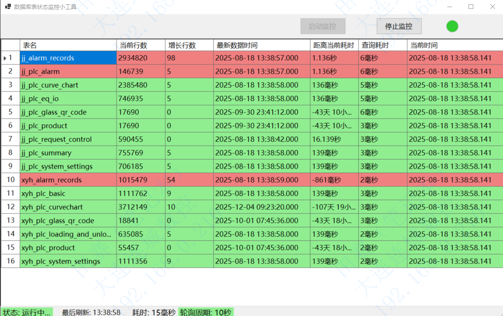
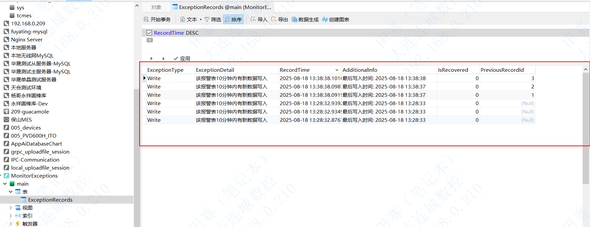

# Winform 数据库表采集状态监控工具

一款用于监控数据库表数据采集状态的 Winform 小工具，支持实时监测 MySQL 数据库表的采集情况，并通过 SQLite 数据库记录自身运行状态。

## 核心功能说明

### 数据采集基础逻辑

正常情况下，所监控的 MySQL 数据库表会按秒级频率持续插入新数据。

### 监控规则详情

#### 普通表监控逻辑

通过 `MAX(CreateTime)` 与当前时间对比，判断数据采集状态：

- 5 分钟内有新数据插入 → 状态正常
- 30 分钟内无新数据插入 → 触发警报
- 超过 30 分钟无新数据插入 → 状态异常

#### 报警类表监控逻辑（与普通表相反）

通过 `MAX(CreateTime)` 与当前时间对比，判断数据采集状态：

- 10 分钟内有新数据插入 → 状态异常
- 60 分钟内有新数据插入 → 触发警报
- 超过 60 分钟无新数据插入 → 状态正常

## 性能优化与数据存储

### 高效查询实现

- 利用 MySQL 表 ID 自增特性，通过 `MAX(ID)` 获取当前表的行数
- 相比全表扫描，显著提升查询效率

### 运行状态记录

- 通过 SQLite 数据库记录工具的运行状况
- 记录示例如下：

## 任务控制机制

- 支持通过 `CancellationTokenSource` 取消监控任务
- 实现原理：通过 `CancellationTokenSource` 终止正在执行的 Task

## 未来规划

- 将 SQLite 中记录的历史数据展示到界面，方便查看运行记录

## 技术栈

- Winform 框架
- MySQL 数据库（监控目标）
- SQLite 数据库（运行日志存储）
- Task 并行编程（任务管理）
